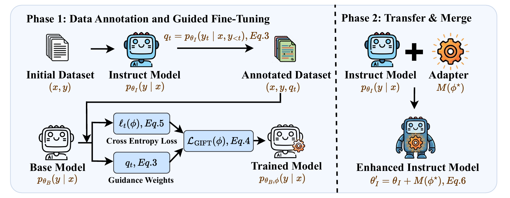

# GIFT: Guided Fine-Tuning and Transfer for Enhancing Instruction-Tuned Language Models



## Abstract

A promising paradigm for adapting instruction-tuned language models is to learn task-specific updates on a pretrained base model and subsequently merge them into the instruction-tuned model. However, existing approaches typically treat the instruction-tuned model as a passive target that is only involved at the final merging stage, without guiding the training process.  
We propose **GIFT** (**G**uided **F**ine-Tuning and **T**ransfer), a simple and efficient framework that incorporates guidance from the instruction model into task adaptation. GIFT fine-tunes a low-rank adapter on the pretrained base model using confidence signals derived from the instruction-tuned model. The learned adapter is then merged into the instruction-tuned model, yielding task-specialized models that preserve general instruction-following behavior.  
We evaluate GIFT on mathematical and knowledge-intensive benchmarks across multiple model families and scales. Results show that GIFT consistently outperforms direct fine-tuning and representative transfer-based baselines, while maintaining robust generalization and favorable test-time scaling behavior.

## Environment Setup

Use `env_setup.sh`:

```bash
bash env_setup.sh
```

Script content:

```bash
# !/bin/bash
set -e

# docker: runpod/pytorch:2.2.1-py3.10-cuda12.1.1-devel-ubuntu22.04
curl -LsSf https://astral.sh/uv/install.sh | sh
export PATH="$HOME/.local/bin:$PATH"
uv venv uv_gift --python 3.12

source uv_gift/bin/activate

uv pip install torch==2.6.0 torchvision==0.21.0 torchaudio==2.6.0 --index-url https://download.pytorch.org/whl/cu124
uv pip install -r requirements.txt
```

## Data

- Training data is stored in `data/training_data`.
- Evaluation data is stored in `data`.

If you want to generate annotated training data, use:
```bash
CUDA_VISIBLE_DEVICES=0 python src/python_scripts/confidence_anno.py --model-path meta-llama/Llama-3.1-8B-Instruuct --data-file data/training_data/numina_cot_2k.jsonl --output-file data/training_data/numina_cot_2k_llama31-8b.jsonl --max-samples 2000 --prompt-type llama31-8b --max-len 2048
```

## Training

Run:

```bash
bash scripts/train_gift.sh
```

GIFT fine-tuning workflow:

1. Train an adapter on the base model using guidance-annotated data.
2. Merge the trained adapter into the instruction-tuned model.

## Evaluation

Run:

```bash
bash src/Qwen2.5-Math/evaluation/sh/eval.sh
```

## Acknowledgement

We thank the open-source projects:

- [QwenLM/Qwen2.5-Math](https://github.com/QwenLM/Qwen2.5-Math)
- [zhuchichi56/ASFT](https://github.com/zhuchichi56/ASFT)

## Citation

If you find our work useful, please cite:

```bibtex
@inproceedings{yang2025impart,
  title={GIFT: Guided Fine-Tuning and Transfer for Enhancing Instruction-Tuned Language Models},
  author={Zhiwen Ruan, Yichao Du, Jianjie Zheng, Longyue Wang, Yun Chen, Peng Li, Jinsong Su, Yang Liu, Guanhua Chen},
  booktitle={Proceedings of the 64rd Annual Meeting of the Association for Computational Linguistics},
  year={2026}
}
```
